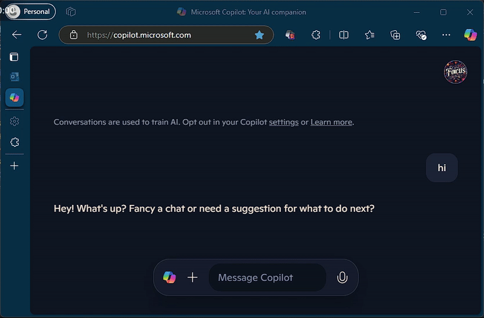

# Microsoft Copilot Chat Copier

<p align="center">
  
</p>

A browser extension for Microsoft Edge and Chrome that enhances the new Microsoft Copilot chat interface with convenient copy functionality. Easily copy individual messages or the entire conversation with custom formatting tags.

## Features

- One-click copying of individual messages
- Copy complete conversations with formatting
- Customizable tags for user and Copilot messages

## Installation

1. Clone this repository:
```bash
git clone https://github.com/webisa/copilot-chat-copier.git
```

2. Open Microsoft Edge and navigate to `edge://extensions/` or Chrome and navigate to `chrome://extensions/`
3. Enable "Developer mode"
4. Click "Load unpacked" and select the extension directory

## Usage

1. Visit [Microsoft Copilot](https://copilot.microsoft.com/)
2. Hover over any message to see the copy button
3. Click the copy button to copy the message
4. You can also copy the entire conversation from the extension popup

## License

This project is licensed under the MIT License - see the [LICENSE](LICENSE) file for details.
